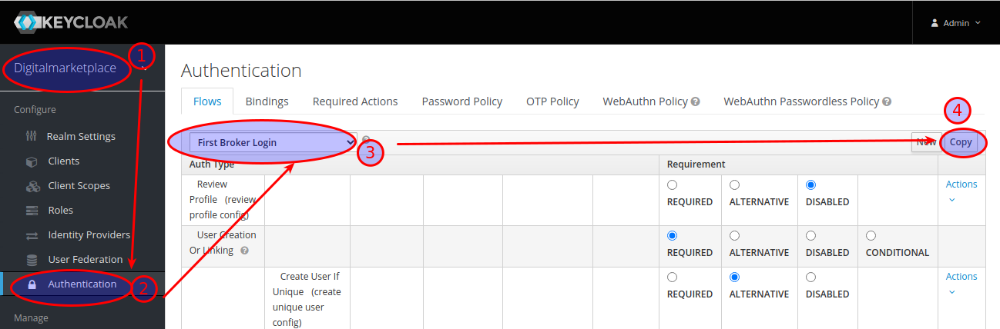
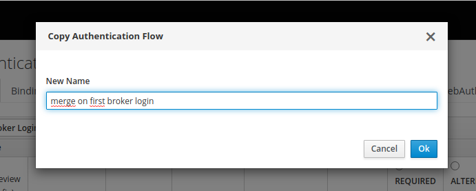
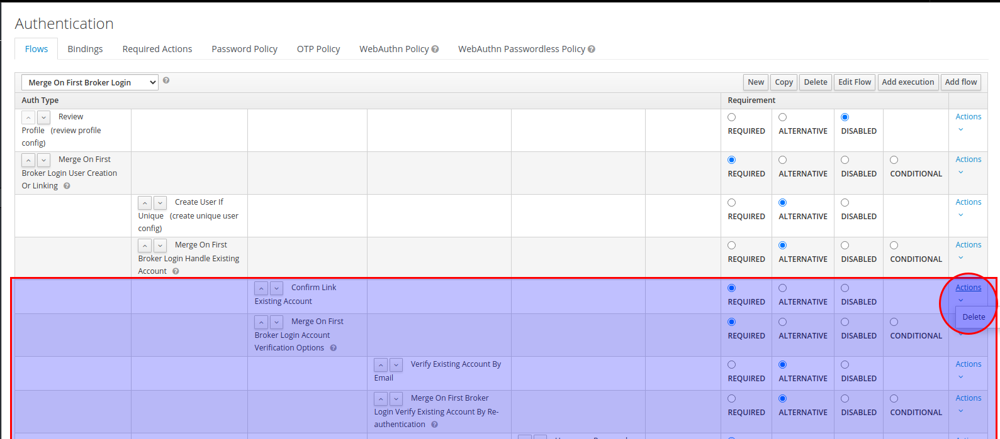
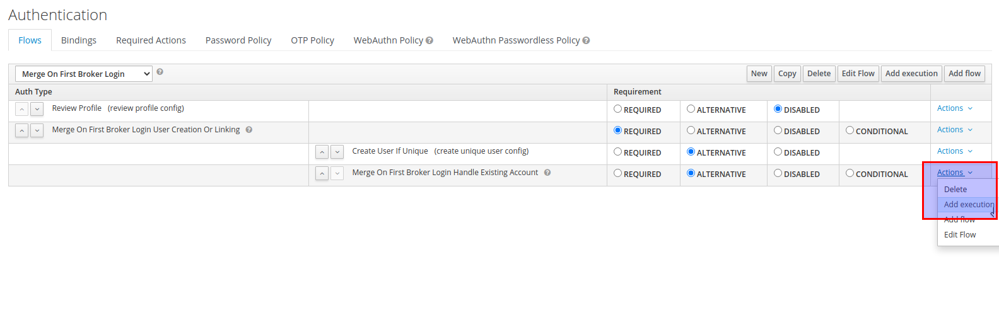
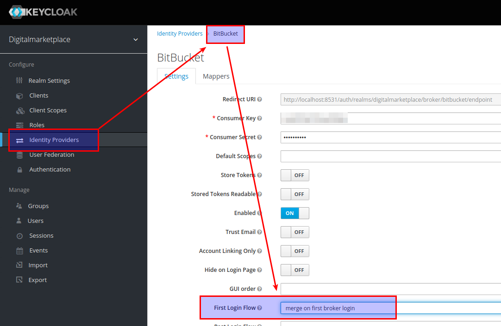

# Déploiement de Keycloak

Basé sur <https://github.com/CQEN-QDCE/keycloak-utils/tree/master/realm-deploy>

## Créer un OAUTH app Github

<https://github.com/settings/developers>

    Application name : "Digital Marketplace local"
    Homepage URL : "http://localhost:3000"
    Autorization callback url : "http://localhost:3000"

## Construire l'image

Passer les valeurs de remplacement comme build arguments.

    podman build -t keycloak_dm_test --build-arg=ROOTURL=http://localhost:3000 --build-arg=GITHUBID=[GITHUB_ID_CRÉÉ]--build-arg=GITHUBSECRET=[GITHUB_SECRET_CRÉÉ] --build-arg=KEYCLOAKURL=http://localhost:8080 .

## Démarrer le conteneur

    podman run -d --name keycloak -p 8080:8080 -e KEYCLOAK_USER=admin -e KEYCLOAK_PASSWORD=admin keycloak_dm_test

## Choix et ajout d'un identity provider

L'application marketplace supporte plusieurs fournisseurs d'identités (identity provider) pour ses authentifications. Ceux-ci doivent être configurés dans Keycloak puis être inscrits dans le fichier de config partagé (src/shared/config.ts)

### Ajouter un identity provider dans keycloak

[Voir documentation Keycloak](https://www.keycloak.org/docs/latest/server_admin/#_general-idp-config)

Un mapper de type "Hardcoded Attribute" doit être ajouté ensuite. Celui-ci doit définir l'attribut "loginSource" avec l'alias du IDP comme valeur.

### Créer un flot d'authentification

Par défaut, le flot `first broker login` oblige l'utilisateur à s'authentifier par mot de passe lorsqu'il se connecte avec une deuxième source d'authentification :

1. L'utilisateur s'authentifie avec Github
2. L'utilisateur se déconnecte
3. L'utilitilateur s'authentifie avec BitBucket
4. Keycloak lui demande de s'authentifier avec son mot de passe Keycloak (qui n'existe pas) afin de fusionner son compte BitBucket et Github dans Keycloak.

Pour éviter l'étape 4, créer un nouveau flot :

1. Copier le flot `first broker login`: 
2. Donner un nom au nouveau flot 
3. Supprimer toutes les exécutions en dessous de "[nom du flot] Handle Existing Account": 
4. Ajouter une exécution en dessous de "[nom du flot] Handle Existing Account": 
5. Choisir l'exécution "Automaticaly Set Existing User"
6. Dans chacun des fournisseurs d'identité, changer le flot utilisé lors de l'authentification et sélectionner celui que vous venez de créer : 
